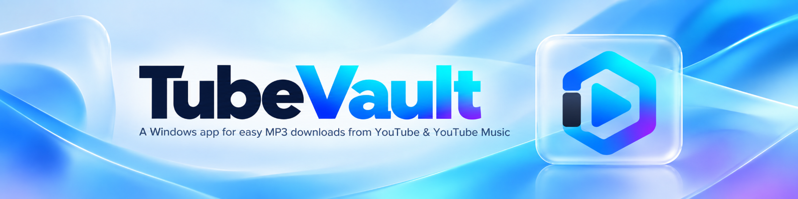
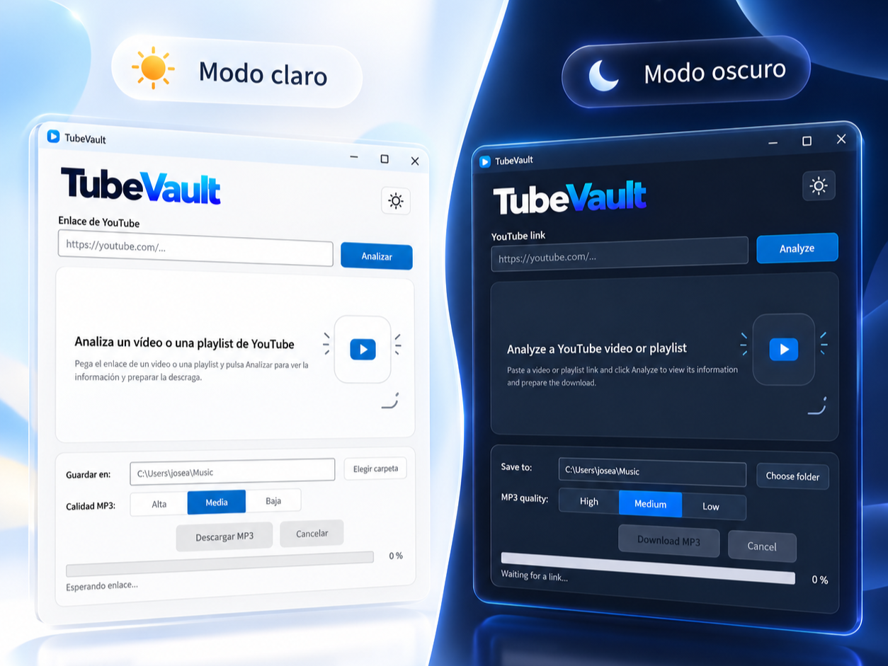



  

  <a href="README.md">Español</a> · <strong>English</strong>

  
  
  
  

  TubeVault makes it easy to download audio from YouTube and YouTube Music as MP3 files on Windows, in a portable app.

  

  <strong>Portable · Self-contained · No .NET installation required</strong>

  

## What TubeVault does

- Downloads individual videos or playlists as MP3 files.
- Reads the available video or playlist information before downloading, such as title, channel, duration or date.
- Lets you select which songs to download from a playlist.
- Offers three MP3 quality profiles: High, Medium and Low.
- Includes Spanish and English interfaces, with Light and Dark modes.
- Automatically manages yt-dlp, FFmpeg and ffprobe.

## How to use it

1. Download the latest version of TubeVault.
2. Extract the ZIP into any folder.
3. Run `TubeVault.exe`.
4. Paste a YouTube or YouTube Music link and choose what you want to download.

On the first run, TubeVault automatically prepares the components it needs. You do not need to install yt-dlp, FFmpeg, ffprobe or .NET manually.

## Portable

TubeVault does not need to be installed.

The application and its data stay within its own folder. During use, a `data/` folder is created next to `TubeVault.exe` to store settings, tools and logs.

You can move TubeVault to another location by keeping the whole folder together.

## Compatibility

- Windows 11 x64.
- Windows 10 x64.
- Self-contained build for `win-x64`.

Windows 11 is the main platform for development and testing.

## Security

TubeVault does not yet have a digital code signature.

The stable version has been successfully tested on a Windows 11 computer with Smart App Control enabled. This does not guarantee the same behavior on every computer or Windows configuration.

You do not need to disable Smart App Control or SmartScreen, or add exclusions, to use TubeVault.

## Documentation

For more detailed information:

- [Privacy](PRIVACY.md)
- [GPL-3.0 license](LICENSE)
- [Third-party components](THIRD-PARTY-NOTICES.md)
- [Security](SECURITY.md)
- [Contributing](CONTRIBUTING.md)
- [Architecture](ARCHITECTURE.md)
- [Product documentation](docs/PRODUCT.md)
- [Release process](docs/RELEASE_PROCESS.md)
- [Code signing policy](docs/CODE_SIGNING_POLICY.md)

